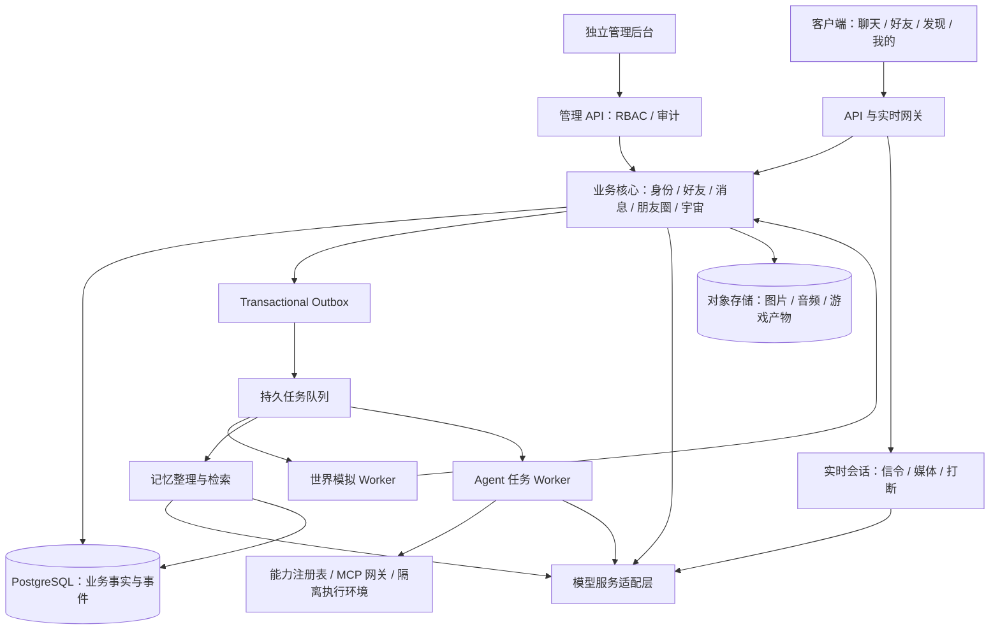
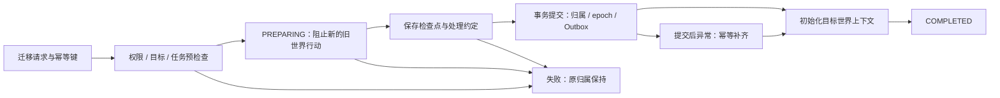

**AI 社交与双宇宙平台工程计划书**

版本：V1.2 · 方案评审稿（通用 Agent、双宇宙、管理后台与 GitHub 开发环境）
日期：2026-09-28
文档性质：产品需求基线、系统设计建议与研发交付流程。文中的性能指标、容量与部署方案属于规划目标，实施前需要通过技术验证确定。

**01｜项目定位与范围。** 构建具有微信式交互结构的 AI 社交应用。AI 拥有稳定身份、定制声音、持续记忆、日程、目标和虚拟生活，能够主动交流、发布朋友圈、参与共享世界，以及通过通用 Agent 能力完成内容生产、软件开发、资料分析和工具操作等任务。

宇宙包含两种类型：平台提供的公共宇宙，以及容纳某位用户全部 AI 好友的个人宇宙。不同角色可以在同一宇宙产生交集，用户可以切换查看宇宙，或迁移单个、多个角色。

产品成功标准包括：身份与经历连续、对话自然、音视频可用、世界状态一致、权限边界明确、成本可控。项目管理采用需求追踪、架构评审、增量交付、自动化验证及可回退发布。

研发安全活动纳入 SDLC，参考 [NIST SSDF](https://csrc.nist.gov/pubs/sp/800/218/final)；应用控制要求映射至 [OWASP ASVS](https://owasp.org/projects/asvs?tab=main) 的适用条目。具体控制集在设计评审时锁定。

**02｜需求基线与追踪矩阵。** “已确认”来自当前讨论；“建议基线”用于工程设计，后续可通过变更记录调整。

| ID | 需求域 | 交付内容 | 主要验收依据 |
|---|---|---|---|
| R-01 | 信息架构 | 聊天、好友、发现、我的四个主入口 | 原型与实际导航一致，主要流程可达 |
| R-02 | AI 好友 | 独立人格、头像、背景、声音、目标及能力配置 | 两个角色的身份与权限保持独立 |
| R-03 | 消息系统 | 文字、图片、语音消息、任务卡片、作品卡片、通话记录 | 断线重连、重复发送和排序场景正确 |
| R-04 | 实时语音 | 双向呼叫、流式语音、定制音色、打断和上下文衔接 | 真机、真实服务及网络干扰测试 |
| R-05 | 视频对话 | 摄像头输入、持续视觉理解、AI 端形象展示 | 视觉能力与形象渲染分别验收 |
| R-06 | 主动行为 | 主动消息、来电、跟进约定 | 遵循频率、免打扰和可取消设置 |
| R-07 | 拟人化与记忆 | 稳定人设、关系状态、分层记忆、纠正与遗忘 | 多轮、跨天、变更及删除评测 |
| R-08 | 虚拟生活 | 上学、工作、休息、目标推进和事件影响 | 事件因果、角色位置和时间一致 |
| R-09 | 个人宇宙 | 自有角色共同生活、相识、合作和形成关系 | 多角色事件具有统一事实和不同视角 |
| R-10 | 平台宇宙 | 已加入角色跨用户交往 | 参与权限、公共可见性及数据隔离 |
| R-11 | 宇宙切换 | 视角切换、单个迁移、批量迁移及返回 | 身份连续、状态不重复、失败可恢复 |
| R-12 | 朋友圈 | 用户与 AI 发文、配图、作品分享、评论互动 | 来源与可见范围正确，发布可去重 |
| R-13 | 通用 Agent | 目标理解、规划、工具执行、结果观察、验证修正及交付；覆盖文档、数据、媒体、软件和外部系统任务 | 按任务目标验证实际结果，产物或操作回执可追踪 |
| R-14 | MCP 与 Skill | 可扩展能力注册、工具接入、技能管理、任务编排、权限及预算控制 | 新能力可通过契约接入，权限、取消与恢复流程通过 |
| R-15 | 多模型 | 按能力选模型、服务配置、运行诊断 | 切换保留角色数据，兼容性可检测 |
| R-16 | 用户设置与用量 | 记忆管理、数据导出、使用额度及任务控制 | 操作可追踪，额度限制真实生效 |
| R-17 | 独立管理后台 | 查看每个用户的账户、在线、AI、宇宙、通话、任务、用量与异常状态 | 状态来源及时，后台分级权限和审计可验证 |

当前按应用内网络通话设计。手机号拨号、完整三维可漫游世界、真人社交网络及第三方创作者市场，列为独立待评估范围，不作为既定实现承诺。

**03｜交互与产品状态模型。** 原型需要覆盖正常、加载、空白、失败、权限缺失、断网及恢复状态。

| 页面 | 核心职责 | 关键子流程 |
|---|---|---|
| 聊天 | 会话、消息、通话、任务和作品 | 发消息 → 流式回复；发起任务 → 进度 → 产物 |
| 好友 | 角色管理与资料 | 新建角色 → 人设与声音 → 生活设定 → 所属宇宙 |
| 发现 | 朋友圈和宇宙入口 | 浏览动态 → 查看事件；选择宇宙 → 查看生活 → 迁移 |
| 我的 | 账户及个人控制项 | 服务配置、记忆管理、工具权限、免打扰、用量 |

设计交付包括用户旅程、信息架构、交互原型、Design Tokens、组件状态规范及无障碍要求。通话原型单独覆盖拨出、来电、接听、拒接、未接、通话中、重连和结束。

**04｜总体架构。** 建议采用 Modular Monolith（模块化单体）承载业务事务，将世界模拟、实时媒体和非可信代码执行作为独立进程或服务运行。模块之间定义清晰的领域接口，后续依据吞吐量、延迟和维护成本决定拆分。



建议技术基线：

| 层级 | 建议 | 选型约束 |
|---|---|---|
| Web 客户端及管理后台 | TypeScript + React，独立应用入口及权限边界 | [React 文档](https://react.dev/learn)；用于网页端和浏览器验证 |
| 移动客户端 | 按首发平台评估跨端与原生集成 | 后台、锁屏来电及推送必须真机验证；网页测试不能替代 |
| 业务 API | Python + FastAPI，按领域分模块 | [FastAPI 文档](https://fastapi.tiangolo.com/)；模型逻辑与业务事务解耦 |
| 业务数据 | PostgreSQL | 事务、约束、权限范围和迁移版本共同保证一致性 |
| 记忆检索 | pgvector + 关键词检索 + 时间过滤 | 中文分词、实体匹配与召回质量需实测；[pgvector 文档](https://github.com/pgvector/pgvector#hybrid-search) |
| 缓存和协调 | Redis 等可替换组件 | 仅作为派生缓存或短期协调，事实数据仍落持久存储 |
| 异步执行 | 持久队列 + 重试 + Dead-letter Queue | 明确投递语义、幂等策略、优先级与背压 |
| 实时通信 | WebRTC 媒体 + 独立信令与会话管理 | WebRTC 支持实时媒体通信；连接、鉴权和推送需应用实现。[W3C 规范](https://www.w3.org/TR/webrtc/) |
| 资源存储 | 对象存储与访问授权 | 音色素材、图片和作品按权限及保留策略管理 |
| Agent 执行 | 持久任务编排 + 能力注册表 + 隔离 Worker | 按任务能力选择工具、浏览器、文件、代码或媒体执行器，统一权限、预算和结果验证 |
| 观测 | 结构化日志、Metrics、Trace | 贯通消息、模型请求、世界事件、任务和迁移 |

基础设施版本、框架版本、模型标识和协议版本通过 ADR 与依赖锁定文件记录。

**05｜领域模型与数据一致性。** 核心实体建议如下：

| 实体 | 主要字段或职责 |
|---|---|
| User | 用户身份、账户配置、额度策略 |
| Agent | agent_id、owner_id、persona_version、voice_profile、能力配置 |
| Universe | universe_id、类型、规则版本、世界时钟、准入策略 |
| Residency | 角色当前及历史归属、状态、epoch、进入与离开时间 |
| WorldEvent | event_id、universe_id、事件序号、世界时间、参与者、结果、可见范围 |
| Observation | 某个角色从某个事件实际获得的信息 |
| Relationship | 人物关系、所属世界、变化依据与版本 |
| Memory | 内容、来源、所属范围、有效时间、状态与派生关系 |
| Conversation / Message | 会话、消息序号、内容、发送与接收状态 |
| CallSession | 主被叫、媒体类型、状态、结束原因、播放确认 |
| AgentTask | 目标、验收条件、权限快照、执行状态、预算、检查点及结果 |
| TaskStep / ToolExecution | 步骤依赖、输入输出、工具版本、幂等键、执行日志与错误 |
| Capability | 能力 ID、输入输出 Schema、权限需求、执行器和版本 |
| Artifact | MIME 类型、资源引用、版本、预览方式、验证记录和关联任务 |
| ActionReceipt | 外部操作对象、操作状态、结果引用、校验依据及关联任务 |
| Migration | 来源、目标、幂等键、状态、检查点和异常 |
| Notification | 触发依据、收件人、通道、去重键、发送状态 |
| UserPresence | 派生的在线状态、设备会话、最后心跳和数据新鲜度 |
| AdminPrincipal / Role | 后台身份、角色与操作范围 |
| AdminAuditEvent | 操作者、对象、动作、原因、时间和结果 |

必须建立的系统不变量：

1. 角色身份由稳定的 agent_id 表示；迁移与模型切换不重新创建角色身份。
2. 建议默认每个角色同一时刻只有一个 ACTIVE Residency，并由数据库约束保护。
3. 同一公共事件只保留一份权威事实；各角色的观察和表达分别保存。
4. 越权数据在服务端查询和事件分发阶段隔离，不能依靠提示词约束。
5. 私人对话、私人宇宙和公共宇宙的记忆具有明确 scope。公共行动只读取允许公开的上下文。
6. 可变化事实携带有效期；过往事实与当前事实不能混用。
7. 模型生成 ProposedAction，规则校验后才写入世界。模型不直接修改权威业务状态。
8. 事件消息按至少一次投递设计，消费者通过 event_id 与业务幂等键去重，不承诺天然 exactly-once。
9. 关键业务写入与 Outbox 写入处于同一事务；异步失败可从检查点重试。
10. 用户明确纠正、取消和遗忘要立即形成约束，随后完成派生索引及缓存处理。

**06｜角色拟人化与长期记忆。** 人格由固定设定、对话示例、当前生活情境及关系状态组成。固定人设有版本，动态表达由已发生事件和当前对话驱动。

记忆分为：核心资料、当前上下文、个人经历、共同经历、关系习惯、未来事项。来源至少区分用户陈述、已验证工具结果、虚拟世界事件和模型推测。

写入路径：原始消息或事件 → 候选记忆提取 → 来源校验 → 时间与指代解析 → 去重及冲突处理 → 持久化 → 更新索引。一般整理异步执行；明确纠正、删除和取消在当前操作中先更新权威约束。

读取路径：按 owner / agent / universe / visibility 筛选 → 混合检索 → 排序 → 必要时回查原始片段 → 构建上下文。检索失败不作为编造经历的依据。

遗忘包含在线检索、摘要、缓存及来源片段的再次提取抑制；备份按照单独保留策略过期，不能宣称点击删除即可清空所有备份副本。

文字、语音和视频共享统一事件语义。通话以实际播放范围及可信转写为基础记录共同经历；未发送的草稿或被打断而未播放的内容不能被记作用户已经听过。

评测覆盖信息提取、跨会话推理、时间推理、知识更新和不确定时的回答行为，参考 [LongMemEval](https://arxiv.org/abs/2410.10813) 的任务划分，另增加角色隔离与删除回归用例。

**07｜宇宙模拟与社交运行机制。** 世界状态由地点、时间、角色、目标、资源、关系和事件组成。首版建议以地点图和事件时间线实现模拟；二维或三维表现是独立的客户端呈现决策。

调度采用 Event-driven Simulation 与离散事件机制：

- 角色有日程和待办；世界只处理到期事项、相关事件及用户干预。
- 相遇候选由同地点、时间重叠、关系与兴趣筛选。
- 模型在需要表达、规划或判断时调用；规则驱动的常规活动可直接推进。
- 每个世界、角色和社交回合都设置行动预算、最大轮数和冷却时间，控制递归互动。
- 用户离线时根据预算推进模拟；低活跃区采用摘要式推进，重新活跃时展开相关事件。
- 世界时钟与真实时间分别记录。平台宇宙建议统一时间基准；个人宇宙的倍率与暂停能力另行确认。
- 补算历史事件不自动补发过期来电或连续通知；主动联系重新检查当前时段和用户设置。
- 虚拟世界中的目标可以触发通用任务，例如制作演示文稿、整理数据、开发网页、生成图片或小游戏。任务成功并验证后再分享产物或报告操作结果。
- 角色生活模拟和实际任务执行分别记录；现实工具操作沿用用户授予的权限和预算。

**08｜关键业务流程。** 以下流程构成后续接口契约、状态机和 E2E 测试的依据。

**流程 A：创建好友与进入生活。**

注册或登录 → 创建角色资料 → 设置人设与声音 → 配置能力与主动性 → 设置生活背景 → 选择宇宙 → 校验准入 → 建立 Residency → 初始化日程 → 开始聊天与生活。

失败处理：素材上传、声音配置和角色创建分别具有状态；创建成功但声音暂不可用时，界面应明确实际状态。

**流程 B：聊天与记忆更新。**

1. 客户端发送 client_message_id，服务端完成鉴权、去重和消息入库。
2. 读取当前 persona_version、生活状态、会话上下文和有权限的记忆。
3. Model Router 根据所需能力选择已配置服务，检查上下文和预算。
4. 生成回复并流式发送；新消息或打断可取消尚未完成的输出。
5. 记录发送结果，异步提取和校验记忆。
6. 对需执行的工作建立 AgentTask，并通过任务卡片回传状态。

失败处理：请求重试不能重复写消息或执行工具；模型超时与不兼容错误显式区分；回退只使用用户配置允许的服务。

**流程 C：AI 之间相遇并发布朋友圈。**

到期活动或事件 → 筛选相关角色 → 校验地点、时间和权限 → 生成候选行动 → 规则检查 → 原子写入 WorldEvent 与 Outbox → 派生各角色 Observation → 更新关系与记忆 → 决定是否生成动态 → 检查资源及可见性 → 发布。

约束：正在迁移、已经离开或无参与资格的角色不能继续提交旧世界行动。事件提交检查 Residency epoch，拒绝过期 Worker 的写入。

**流程 D：跨宇宙迁移。**



- 切换查看只改变用户视角，迁移才改变角色归属。
- 人格、声音和与用户的关系持续保留；各宇宙的住所、关系与经历按来源保留。
- 同库实现优先使用事务保护归属切换；未来跨分区时通过版本化协议处理 Saga 与补偿。
- 已发生的外部动作不能靠数据库回滚撤销，需要显式补偿或保留结果。
- 活跃通话建议结束后再提交迁移；用户可看到等待原因。
- 世界绑定任务依据类型暂停、取消或重新安排；可携带的通用任务保留原任务 ID、检查点和产物版本。
- 批量迁移包含预检查和逐角色结果。首版建议允许部分成功、可单独重试，界面明确结果。
- 返回原宇宙时结合当前世界时间恢复生活，避免把旧快照直接覆盖世界现状。

**流程 E：实时语音与视频。**

会话授权 → 创建 CallSession → 呼叫与通知 → 接听 → 媒体连接 → 载入角色及记忆 → 流式交流 → 挂断或异常结束 → 写入通话记录与可选摘要。

核心状态机：

```text
CREATED → RINGING → CONNECTING → ACTIVE → ENDED
                    │           ↕
                    │      RECONNECTING
                    └──────────→ ENDED

终态原因：COMPLETED / REJECTED / MISSED / CANCELLED / FAILED
```

为支持定制音色，默认技术验证路线为流式 ASR → LLM → 流式 TTS，同时保留端到端语音适配接口。每个候选服务实际验证流式能力、音色兼容性和中断能力。

用户打断时取消当前生成、停止播放队列并更新已播放范围。视频中的摄像头理解与 AI 形象驱动独立实现、分别验收。用户关闭摄像头或麦克风后，后续采集立即停止。

后台与锁屏来电通过目标平台通知机制实现；系统杀进程、拒绝通知权限和弱网场景必须在真机上验证，不用前台页面模拟替代。

**流程 F：通用 Agent 任务。**

每个 AI 好友具备可扩展的任务执行能力。小游戏是软件产物的一种，任务入口支持开放目标；实际执行范围由已接入的模型、工具、Skill、执行环境和用户授权决定。

| 能力类别 | 示例任务 | 交付结果 | 验证方式 |
|---|---|---|---|
| 文档与办公 | 报告、计划书、演示文稿、电子表格、PDF | 可下载及预览的文件 | 文件可打开，内容满足要求，表格计算可核验 |
| 资料与数据 | 搜集资料、比较方案、清洗数据、统计分析、图表 | 报告、数据集或分析结果 | 来源可追踪，统计与输入数据一致 |
| 视觉与媒体 | 图像、海报、插画、音频、视频及相关素材 | 媒体资源与版本 | 格式和内容检查，必要时人工评估 |
| 软件与交互作品 | 网站、Web 应用、脚本、插件、接口、游戏 | 源码、构建包、运行地址或预览 | 编译、启动、行为测试及运行日志 |
| 文件与浏览器 | 整理授权文件、网页操作、资料填写与下载 | 文件变更或操作记录 | 检查目标状态并保存结果证据 |
| 外部业务工具 | 查询数据、更新记录、管理日历、触发工作流 | ActionReceipt 与业务结果 | 核对工具返回和目标系统状态 |
| 自动化与持续任务 | 定时整理、监测已指定变化、执行多步骤流程 | 周期结果、事件或后续任务 | 触发条件、执行次数、预算及停止条件可验证 |

通用执行循环：

```text
目标理解与完成条件
  → 能力与权限匹配
  → 创建任务、预算及检查点
  → 规划步骤与依赖
  → 调用工具或执行技能
  → 观察结果
  → 对照完成条件验证
  → 必要时修正方案并继续执行
  → 保存文件、操作回执或其他结果
  → 在聊天中交付，并支持后续修改
```

简单任务可直接执行；复杂任务采用有依赖关系的步骤编排，必要时分派子任务，所有执行共享父任务的权限范围和总预算。

任务状态建议为：QUEUED、PLANNING、RUNNING、WAITING_INPUT、PAUSED、VERIFYING、SUCCEEDED、FAILED、CANCELLED。等待外部状态与工具失败分别处理；取消在可中止的步骤边界生效，已发生的外部操作保留真实记录。

Capability Registry 记录能力 ID、版本、输入输出 Schema、执行器、权限需求、取消支持与成本信息。新增文件类型或工具可以通过注册适配器扩展，前端根据 Artifact 类型显示预览、下载、运行或操作结果卡片。

MCP 处理工具通信和授权；协议版本在实现评审中固定，并对照 [MCP Authorization](https://modelcontextprotocol.io/specification/latest/basic/authorization) 验证授权范围。

Skill 使用本项目的版本化包描述：ID、版本、入口、依赖、权限声明和校验信息；不同生态的技能包通过兼容层接入。第三方文档、工具输出与 Skill 内容不能自行提升账户权限。

工具调用遵循已有授权范围，缺少必要信息或权限时将任务置为 WAITING_INPUT。对外发送、发布和修改系统数据具有明确的操作步骤与权限要求。副作用请求使用幂等键；无幂等能力的工具，重试前先核查实际执行状态。

代码、网页、插件及游戏产物在隔离环境中构建和运行；主应用令牌与供应商密钥不进入产物。文件执行器有工作目录边界，浏览器执行器有账户会话隔离，远程工具使用其独立凭证。统一设置资源配额、网络范围、超时和预算。

聊天界面展示目标、当前步骤、待输入项、耗时、实际用量和产物版本。管理后台能够查看任务步骤、工具结果、失败原因和取消状态。完成判定同时支持文件产物与外部操作结果，依据真实执行证据标记成功。

**流程 G：管理后台查看用户与执行操作。**

客户端心跳与活动事件 → 在线状态聚合；账户、通话、世界和任务事件 → 用户运行状态视图。后台查询经服务端权限检查，返回状态、来源与更新时间。支持按用户 ID、账户状态、活跃时间、异常类别和用量检索，并分页访问用户详情。

后台操作通过命令接口提交，执行时校验目标版本、操作权限和幂等键；记录审计事件并返回实际结果。页面操作权限与服务端校验保持一致。

**09｜研发流程与阶段门禁。** 每个阶段都有输入、交付物和退出条件。一个人可以承担多个职责，但评审记录需要真实反映执行者及验证方式。

| 阶段 | 核心工作 | 必须交付 | 退出条件 |
|---|---|---|---|
| G0 Discovery | 确认目标、范围、用户旅程、平台和预算 | PRD、需求 ID、假设与决策清单 | 核心场景可验收，重大未知有负责人 |
| G1 Technical Spike | 验证音色实时性、后台通话、记忆、模拟与迁移 | PoC、测量数据、可复现说明 | 关键链路可行或明确收缩方案 |
| G2 UX / Architecture | 原型、领域模型、状态机、接口与数据设计 | 设计稿、RFC、ADR、ERD、API/Event 契约 | 数据流、异常流程和兼容策略完整 |
| G3 Vertical Slice | 实现第一条完整用户路径 | 可演示构建、E2E 用例、运行日志 | 从客户端到持久数据及真实模型贯通 |
| G4 Incremental Delivery | 按需求 ID 迭代开发 | 小范围 PR、审查记录、自动化测试 | 单项 Definition of Done 满足 |
| G5 Verification | 功能、并发、模型评测、权限、成本验证 | 测试报告、缺陷记录、容量报告 | 发布阻断缺陷清零，目标指标有证据 |
| G6 Production Readiness | 部署、备份恢复、监控、回滚及运维 | Runbook、SLO、恢复与回退演练记录 | 可观察、可恢复、可限制成本 |
| G7 Controlled Release | 内测、灰度、指标观察及扩量 | 发布记录、观测结果、问题复盘 | 用户体验与可靠性满足当前阶段目标 |

RFC 记录设计提案和取舍；ADR 记录采用的方案、理由及替代方案。需求调整通过变更条目评估对接口、数据、验收和排期的影响。PRD → 任务 → PR → 测试 → 构建版本形成可追踪链路。

职责分配：产品负责人定义体验和优先级；设计负责人维护交互；技术负责人维护架构与关键不变量；开发负责人实现模块；验证负责人维护测试和评测；运维负责人维护发布与恢复。实际人员和投入待确定。

**10｜持续集成与交付。** 建议流水线如下：

```text
需求条目与验收条件
  → 小范围代码变更
  → 静态检查 / 类型检查 / 格式检查
  → 领域单元测试
  → 数据库与队列集成测试
  → API / Event / Provider 契约测试
  → 变更相关的 Agent Eval 与客户端 E2E
  → 依赖与密钥检查
  → 代码审查
  → 可追踪构建产物
  → Staging 部署
  → 真实服务、真机与回归验证
  → 灰度发布
  → 指标观察与逐步扩量
```

开发期采用短分支、小 PR 和持续集成。测试按变更影响选择，定期运行完整回归。供应商契约测试使用专用测试配置和明确预算；离线 Mock 测试与真实服务测试分别报告。

发布产物记录代码提交、依赖锁、数据库迁移、模型配置、Prompt 版本和 Skill 版本。数据库变更采用兼容扩展、迁移、收缩流程；破坏性变更不能依赖简单回滚脚本兜底。

灰度发布覆盖代码、模型、提示词、记忆策略和模拟规则。按世界分组发布模拟规则，避免同一宇宙出现不兼容的事件解释。发布策略参考 [Google SRE 的 Canarying Releases](https://sre.google/workbook/canarying-releases/)。

**11｜测试策略与候选指标。** 以下指标是初始工程目标，不代表已经达到。性能测试需要记录客户端、区域、网络、并发、服务版本、采样数量和失败样本；PoC 后将阈值与目标人群实际体验对齐。

| 指标 | 初始目标或判定方法 | 计量说明 |
|---|---|---|
| 消息接收确认 | API 接收至持久化 ACK，P95 ≤ 300 ms | 服务端处理时间，另报客户端端到端时间 |
| 文字首个有效输出 | P95 ≤ 3 s | 从用户发送到首个可见有效内容，包含供应商等待 |
| 语音响应 | 用户发言结束至首段有效播放，P95 ≤ 2.5 s | 包含轮次检测、网络、识别、生成、合成与缓冲 |
| 语音打断 | 检测到用户发言至旧音频停止，P95 ≤ 300 ms | 检测本身另测漏检率与延迟 |
| 记忆质量 | 至少 200 个固定场景，事实问答正确率目标 ≥ 90% | 同时分别统计纠正、时间、弃答和冲突处理 |
| 数据隔离 | 指定回归集中越权和串记忆结果为 0 | 覆盖跨用户、跨角色、跨世界及公共行为 |
| 迁移正确性 | 指定并发和故障注入中双 ACTIVE、丢失归属为 0 | 覆盖重复请求、Worker 迟到、断电恢复 |
| 遗忘 | 删除完成后指定回归集中不再检索或重新提取 | 原文、摘要、索引、缓存和备份保留策略分别验收 |
| 通用任务交付 | 规定的文档、数据、媒体、软件与工具任务满足各自完成条件 | 文件可读、程序可运行、数据可核验、外部操作有真实回执 |
| 可用性 | 公测候选目标：关键用户旅程滚动 28 天 ≥ 99.9% | 纳入影响该旅程的供应商故障，归因单独统计 |

短期内测报告实际样本和观察窗口，不用短时间运行结果宣称达到长期 SLO。可靠性目标及错误预算管理参考 [Google SRE：Implementing SLOs](https://sre.google/workbook/implementing-slos/)。

测试矩阵至少包含：

- 消息顺序、去重、断线恢复、取消后迟到输出。
- 人格一致性、换模型、跨天记忆、事实更新、遗忘及未发生事件的回答。
- 多 AI 共享事件一致性、部分可见、权限变化和关系更新。
- 迁移与聊天、通话、发朋友圈、任务执行同时发生。
- 音视频弱网、丢包、回声、设备切换、后台、锁屏和系统终止。
- MCP 超时、失效凭证、工具输出异常、Skill 更新、预算耗尽及执行取消。
- 通用任务规划、步骤依赖、暂停恢复、能力不可用、跨执行器工作流、文件类型扩展及副作用去重。
- 代表性任务覆盖报告文件、表格分析、可运行应用和授权测试系统中的实际工具操作；按各自完成条件验收。
- 队列积压、重复投递、消费者重启、数据库恢复和供应商不可用。
- 管理后台角色权限、用户状态新鲜度、伪造用户 ID、敏感字段脱敏、批量操作及审计完整性。
- 跨角色情绪与自然度的盲评，自动评估作为辅助，保留人工抽样。

**12｜迭代路线与交付里程碑。** 当前缺少首发平台、团队投入和预算数据，因此按依赖和出口条件安排，不给出固定发布日期。

| 里程碑 | 内容 | 可演示成果 |
|---|---|---|
| M0 需求与验证 | 完成 G0、关键 PoC 和架构评审 | 原型、服务选型数据、主要 ADR |
| M1 最小完整体验 | 一个账户、两个 AI、个人宇宙、文字聊天、基础记忆、一次交集及后台用户列表 | 角色经历影响聊天，后台能定位对应用户和运行状态 |
| M2 日常社交 | 完整四页结构、长期记忆管理、多模型切换、朋友圈、生图和用户详情后台 | 用户持续使用，管理员可查看状态、用量和异常 |
| M3 实时交流 | 定制声音、双向通话、视频理解、AI 形象、通知 | 真实设备上的完整通话流程 |
| M4 共享宇宙 | 平台宇宙、跨用户交集、归属隔离、批量迁移及后台迁移诊断 | 角色往返宇宙且记忆连续，异常可定位 |
| M5 通用行动能力 | MCP、Skill、能力注册表、持久任务编排、多类执行器及产物版本管理 | 在聊天中交付文档、分析结果、可运行应用和可核验的工具操作；游戏为其中一种任务 |
| M6 发布准备 | 全链路回归、容量成本、恢复演练及灰度 | 候选发布版本、报告与运维资料 |

M3 的媒体 PoC 在 M0 提前开展；架构边界稳定后，实时交流与平台宇宙开发可以并行。完整需求分阶段交付，每个阶段保留未完成项和依赖清单。

迭代节奏建议采用 1–2 周工作周期，但实际周期根据人员配置确定。每个迭代结束提供演示、验收证据、缺陷清单及下个周期的范围。

**13｜Definition of Ready / Done。** 开发条目 Ready 需要：需求 ID、用户场景、边界条件、接口或设计依据、可验证验收条件及已知依赖。

完成条目 Done 需要：

1. 实现对应功能与异常状态，并有明确证据。
2. 相关自动化测试与必要的真实服务测试通过。
3. 权限、数据迁移、取消和重试行为符合设计。
4. 修改的接口、配置和运行说明同步更新。
5. 具备日志、指标或可定位问题的追踪信息。
6. 已完成代码审查，性能或成本变化得到记录。
7. 如涉及发布行为，具备可执行回退或前向修复方案。

“能够启动”“截图正常”“Mock 测试通过”分别对应有限的验证范围，状态报告应注明范围和未验证条件。

**14｜运行成本与可观测性。** 成本按对话、语音、图像、模拟、代码执行、媒体流量和存储分类计量。

单用户周期成本 = 文本调用 + 语音识别与合成 + 图像生成 + 世界模拟 + Agent 执行 + 媒体与存储。

世界成本至少记录每个活跃角色小时、每次交集、每个用户日。平台公共事件与个人角色任务的付费归属必须在公测前明确。任务先预留预算，再按实际用量结算；达到限额时停止新的高成本动作并展示状态。

观测字段建议包含 trace_id、owner_id 的脱敏标识、agent_id、universe_id、event_id、task_id、migration_id 和配置版本。日志默认不记录密钥和完整私人对话；调试素材采用受控访问和保留期限。

运营控制包含按服务、世界、角色和工具关闭能力的开关；通知频率、活动密度、单任务步数、超时及预算均可配置。故障后优先恢复持久消息与用户主动操作，再恢复自动生活事件。

**15｜工程文档与决策清单。** 后续交付包应包括：

| 文档 | 内容 |
|---|---|
| PRD | 场景、功能、边界、需求 ID 与验收条件 |
| UX Specification | 四个主页面、通话、宇宙与任务状态 |
| System Design | 组件图、领域边界、ERD、读写路径 |
| API / Event Contracts | 请求与响应、事件 Schema、版本兼容及错误码 |
| Capability / Artifact Contracts | 能力和执行器描述、任务状态、产物预览及操作回执 Schema |
| ADR | 客户端、媒体、存储、模拟、迁移与执行环境选型 |
| Evaluation Plan | 长期记忆、人格、主动行为、真实语音与成本评测 |
| Test Plan / Report | 测试数据、环境、执行结果、缺陷与残余问题 |
| Runbook | 部署、告警处理、备份恢复、回滚与限额控制 |
| Release Manifest | 代码、模型、提示词、数据库及 Skill 的版本记录 |

优先待确认的决策：

| 决策 | 建议起点 | 影响 |
|---|---|---|
| 首发平台 | 移动端体验优先，Web 用于原型和配套访问 | 后台来电、推送、媒体与工作量 |
| AI 视频形象 | 先验证二维形象与视觉理解 | 资产制作、算力和通话效果 |
| API 服务方式 | 平台配置与用户自填接口通过统一适配层管理 | 计费、密钥管理与支持范围 |
| 世界表现形式 | 地点图、事件时间线及朋友圈 | 三维引擎是否进入首发范围 |
| 时钟与干预 | 公共世界统一时钟；私有世界可配置规则 | 迁移、回放、主动通知与一致性 |
| 批量迁移语义 | 逐角色结果、部分成功可重试 | 操作反馈、事务边界及复杂度 |
| 团队与运行预算 | 先确定人员投入及测试额度 | 工期、容量、供应商与交付节奏 |

**16｜独立管理后台。** 管理后台为本期核心范围，采用独立入口和管理 API，复用现有领域数据与事件。后台可见每个用户的运行状态，同时以权限范围控制资料访问和操作。

| 模块 | 信息与操作 | 数据来源 |
|---|---|---|
| 运行总览 | 在线人数、活跃会话、通话、任务、模拟积压、异常和用量 | 聚合指标与事件读模型 |
| 用户列表 | 用户 ID、显示名、账户状态、在线状态、最近活动、角色数、异常标记 | 账户数据、Presence 和统计视图 |
| 用户详情 | 设备会话、AI 清单、宇宙归属、通话状态、任务、迁移、用量与错误 | 关联实体及事件 |
| 角色与宇宙 | 当前活动、所处地点、日程状态、世界归属、模拟延迟 | Residency 与已提交世界事件 |
| 通话与任务 | 当前状态、计划步骤、执行器、工具调用、产物或操作回执、失败原因、重试次数、耗时及取消入口 | CallSession、AgentTask、TaskStep 与 ToolExecution |
| 服务与用量 | 模型可用性、额度、速率限制、按用户和功能的成本 | 服务监控、预算账本 |
| 管理操作 | 限制新任务、暂停角色自动活动、账户停用与恢复、终止任务 | 带权限校验和审计的业务命令 |
| 操作审计 | 操作者、对象、动作、原因、前后状态摘要与结果 | 受访问控制保护的审计记录 |

用户状态按四个维度展示，避免把“离线”误判为“账户异常”：

1. AccountState：正常、限制、停用、删除处理中。
2. Presence：在线、空闲、离线、未知；根据有效会话、心跳和活动时间推导。
3. RuntimeActivity：聊天、通话、执行任务、世界模拟，可同时存在多个活动。
4. ServiceHealth：模型错误、任务失败、额度不足、通知失败等独立事件。

页面显示 last_seen_at、status_updated_at 和数据延迟；心跳缺失按约定阈值更新，未知状态明确呈现。用户离线与 AI 继续生活可以同时成立。

建议后台权限分为：只读运营、客服诊断、运维操作和平台管理员。所有接口校验实际权限范围，关键管理账户启用多因素认证。批量和影响运行的操作需要填写原因、展示作用范围并记录结果。

私人聊天、记忆正文、摄像头内容和服务密钥不作为默认用户状态字段。需要额外诊断内容时，单独定义授权与审计规则。后台不能凭借读取状态的权限获得完整账户密钥。

**17｜GitHub 开发、编译与测试环境。** 用户已授权在后续开发和编译时调动现有 GitHub Codespace。当前只读检查结果如下：

| 项目 | 已核实结果 |
|---|---|
| GitHub 活动账户 | kawaiilord |
| 仓库 | kawaiilord/devbox |
| Codespace | bug-free-eureka-gxrp4j6g59wjh9x7v |
| 当前状态 | Shutdown |
| 机器类型 | basicLinux32gb |
| 资源 | 2 vCPU、8 GiB 内存、32 GiB 磁盘 |

以上为本次查询的资源快照。实际启动时再次检查可用空间、工具链、运行环境及账户用量。现有授权支持按需启动并执行开发、编译和验证；完成工作后停止实例，产物上传或同步到明确的保存位置。

开发工作流：

读取仓库规范与现有工作 → 建立隔离分支或工作目录 → 使用固定开发容器与依赖锁 → 实现变更 → Codespace 运行静态检查、编译及相关测试 → 记录构建版本和证据 → 同步代码与产物 → 停止开发实例。

后续为仓库添加可复现的 devcontainer 配置、初始化说明和 CI 定义。供应商密钥通过环境或密钥服务注入，运行中的用户数据与凭证不进入代码提交。

Codespaces 承担开发、Web 与后端编译、离线评测和集成测试。生产 API、世界模拟、通知及媒体服务单独部署。Linux Codespace 不覆盖 iOS 原生编译；若首发含 iOS，需要具备 macOS / Xcode 的构建环境。摄像头、麦克风、锁屏和推送验证在真实客户端完成。

当前实例适合作为初期开发环境。并发压测、较大构建和图像模型推理按测量结果安排其他执行资源；不假设现有实例具备 GPU。

下一项具体交付为 PRD 需求基线、客户端与管理后台的全流程原型，以及 M0 技术验证任务列表。完成平台及预算决策后，再将里程碑拆分为人员、依赖、估时和验收条件明确的实施任务。
